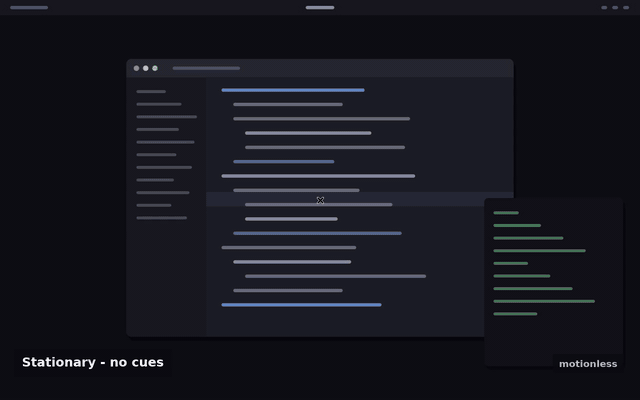
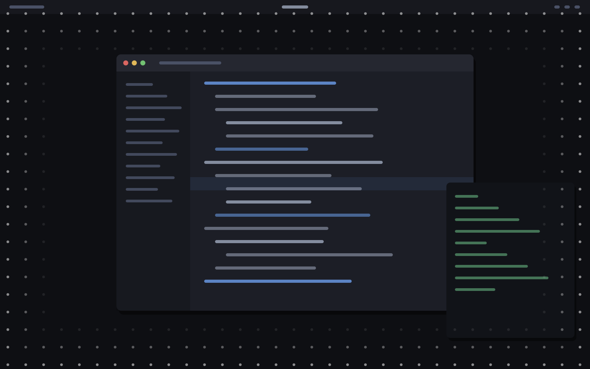

<h1 align="center">motionless</h1>

<p align="center">
  <em>Vehicle motion cues for Linux — read your screen in a moving car without feeling sick.</em>
</p>

<p align="center">
  <a href="https://github.com/guilyx/motionless/actions/workflows/ci.yml"></a>
  <a href="https://pypi.org/project/motionless-overlay/"></a>
  <a href="LICENSE"></a>
  
</p>

<p align="center">
  
</p>

<p align="center">
  <sub>A real recording of motionless running, not a mockup — the overlay is
  driven by actual acceleration and screen-recorded. Reproducible with
  <code>./docs/capture_demo.sh</code>.</sub>
</p>

---

Motion sickness happens when your inner ear feels movement your eyes do not.
Apple's **Vehicle Motion Cues** fixes the mismatch by drawing dots at the edges
of the screen that drift with the vehicle, giving your eyes the motion your
body already feels.

**motionless** is that, for Linux. A transparent, click-through overlay of dots
that respond to real acceleration, controlled by a one-word command you can
bind to a hotkey.

```
motionless toggle
```

## Install

```bash
curl -fsSL https://raw.githubusercontent.com/guilyx/motionless/main/install.sh | bash
```

The installer pulls in the GTK bindings from your package manager (apt, dnf,
pacman or zypper), installs motionless into its own isolated environment with
`pipx`, and runs a diagnostic. Read it first if you'd rather — it is one file,
and `--no-deps` skips the package-manager step.

<details>
<summary>Other ways to install</summary>

**pipx**, if you already have the GTK bindings:

```bash
sudo apt install python3-gi python3-gi-cairo gir1.2-gtk-3.0
pipx install --system-site-packages motionless-overlay
```

The `--system-site-packages` flag matters: PyGObject comes from your
distribution, not from pip.

**From source:**

```bash
git clone https://github.com/guilyx/motionless && cd motionless
python3 -m venv --system-site-packages .venv && source .venv/bin/activate
pip install -e .
```

**Uninstall:**

```bash
curl -fsSL https://raw.githubusercontent.com/guilyx/motionless/main/install.sh | bash -s -- --uninstall
```

</details>

## Use it

```bash
motionless start              # start the overlay in the background
motionless toggle             # show/hide the cues — bind this to a hotkey
motionless status             # what is it doing right now?
motionless stop

motionless service install    # start automatically with your session
```

Bind `motionless toggle` to a key in **Settings → Keyboard → Custom Shortcuts**
(GNOME), **System Settings → Shortcuts** (KDE), or your `sway`/`hyprland`
config. Toggling starts the daemon if it isn't running, so one binding is
enough.

### Try it without a car

```bash
motionless run --source demo --verbose
```

The `demo` source replays a synthetic drive — cornering, braking, road noise —
so you can see what the cues look like before you need them.

## Where the motion comes from

Run `motionless sources` to see which of these your machine can use.

| Source | Works when | Notes |
| --- | --- | --- |
| `iio` | Your device has an accelerometer | Most convertibles, tablets and some laptops. Read straight from `/sys/bus/iio`. |
| `udp` | You stream readings from a phone | A phone in the car's cradle is a *better* motion sensor than a laptop on your knees. |
| `demo` | Always | Synthetic drive loop, for previewing and tuning. |

`motion.source = "auto"` (the default) picks `iio` when an accelerometer
exists and falls back to `demo`.

<details>
<summary>Using your phone as the sensor</summary>

Any app that streams accelerometer readings over UDP works. Point it at your
laptop on port 5577 and tell motionless to listen:

```bash
motionless config set motion.source udp
motionless config set motion.udp.host 0.0.0.0   # accept from the network
motionless restart
```

The parser accepts what those apps actually send — one reading per datagram:

```
{"x": 0.1, "y": -0.3, "z": 9.8}
{"ax": 0.1, "ay": -0.3, "az": 9.8}
{"accelerometer": {"x": 0.1, "y": -0.3, "z": 9.8}}
[0.1, -0.3, 9.8]
0.1,-0.3,9.8
```

If your app sends g rather than m/s²: `motionless config set motion.udp.units g`.

> Binding to `0.0.0.0` lets anything on the network move your dots. Do it on a
> network you trust, or keep the loopback default and use an SSH tunnel.

</details>

## Tuning

```bash
motionless config edit                          # opens $EDITOR, reloads on save
motionless config set overlay.opacity 0.4       # applied to the running daemon
motionless config keys                          # every setting
```

Preview changes without a display, or a car:

```bash
motionless preview --lateral 3.0 --longitudinal -1.5 -o look.png
```

The settings worth knowing:

| Setting | Default | What it does |
| --- | --- | --- |
| `overlay.layout` | `edges` | `edges` keeps dots in your periphery; `grid` fills the screen. |
| `overlay.margin` | `0.16` | Width of the peripheral band, as a fraction of the screen's short edge. |
| `overlay.spacing` | `46` | Pixels between dots. |
| `overlay.opacity` | `0.55` | How present the dots are. Lower is calmer. |
| `overlay.sensitivity` | `9.0` | Pixels of travel per m/s² — the main "how much does it move" dial. |
| `overlay.activation` | `0.35` | Acceleration (m/s²) that wakes the cues up. |
| `motion.axis_*` | `x`, `y`, `z` | Sensor-to-screen axis mapping. Prefix with `-` to invert. |

**If the dots move the wrong way**, your accelerometer is mounted differently
from the default assumption. Swap or invert the axes:

```bash
motionless config set motion.axis_lateral -y
motionless config set motion.axis_longitudinal x
```

## Your desktop and the overlay

An always-on-top, click-through window needs cooperation from the compositor,
and Linux desktops differ. `motionless doctor` reports exactly which path your
machine takes.

| Session | How it works | |
| --- | --- | --- |
| Xorg (any desktop) | Override-redirect window with an empty input shape | ✅ Full support |
| Sway, Hyprland, river, KDE Wayland | `wlr-layer-shell` overlay layer | ✅ Full support |
| GNOME Wayland | XWayland fallback | ⚠️ Cues sit above normal windows, but a *fullscreen* Wayland window can cover them |

GNOME's Mutter deliberately does not implement `wlr-layer-shell`, so no
ordinary Wayland client can place an overlay above other windows on GNOME.
XWayland is the honest workaround and works for normal window use; logging
into "Ubuntu on Xorg" removes the caveat entirely.

The overlay is always transparent to input — clicks, scrolls and keystrokes go
straight through to whatever is underneath.

<p align="center">
  
</p>

<p align="center">
  <sub>One frame at full resolution: the cue sits in a peripheral band and
  fades toward the middle of the screen, where your content is.</sub>
</p>

## Something's wrong

```bash
motionless doctor
```

It checks the GTK bindings, your session type, layer-shell availability, every
motion source, your config file, the daemon and the systemd unit — and tells
you the exact package to install for whatever is missing.

| Symptom | Likely cause |
| --- | --- |
| Nothing appears | Cues only show when you're moving. Try `motionless run --always-on`. |
| An opaque black rectangle | No compositing. `doctor` will flag the missing RGBA visual. |
| Dots move the wrong way | Axis mapping — see [Tuning](#tuning). |
| Dots hidden by a fullscreen video | GNOME Wayland's XWayland limitation, above. |
| Barely moves while driving | Raise `overlay.sensitivity`, lower `motion.dead_zone`. |

Logs: `~/.local/state/motionless/motionless.log`.

## How it works

```
sensor ──► gravity high-pass ──► axis remap ──► smoothing ──► dead zone
                                                                  │
                                      ┌───────────────────────────┘
                                      ▼
                        dot displacement + fade ──► GTK overlay, one per monitor
```

Gravity is removed with a slow low-pass rather than a calibration step, so the
cue stays correct when you pick the laptop up or re-seat the tablet. The dots
translate *against* the acceleration — like something loose on the dashboard —
because that is the motion your vestibular system is already predicting.

Everything except the GTK window runs headless, which is why the visual
behaviour is covered by ordinary unit tests. See
[CONTRIBUTING.md](CONTRIBUTING.md) for the layout.

## Prior art

The idea is Apple's. Several people have implemented it since, and one of them
targets Linux — worth knowing about before you pick:

| Project | Platform | Notes |
| --- | --- | --- |
| [Mewtion](https://github.com/aayuxh-vim/Mewtion) | Linux (Wayland only) | Rust + GTK4 layer-shell. Takes motion from an Android phone over USB/ADB, which gives it gyroscope-fused linear acceleration — better than what an accelerometer alone can do. No X11 or GNOME support, and no multi-monitor at the time of writing. |
| [Vehicle Motion Cues](https://f-droid.org/en/packages/dev.davidv.motionsickness/) | Android | Open source, on F-Droid. If the screen you use in the car is a phone, use this rather than anything here. |
| Apple's Vehicle Motion Cues | iOS, iPadOS | The original, built into the OS. |

Where motionless differs: it runs on X11 and through XWayland as well as
layer-shell, which is what makes it usable on GNOME — the default on most
Linux desktops — and it takes motion over plain UDP from anything that can
send it, rather than requiring a cable. It also covers every monitor.

Where it is behind: gravity is removed with a low-pass filter over raw
acceleration, so a very long constant-radius bend fades (see
[How it works](#how-it-works)). A phone reporting gyroscope-fused linear
acceleration does not have that problem — if your sender already removes
gravity, the remaining high-pass here is doing you no favours.

## Contributing

Bug reports, tuning notes and compositor compatibility reports are all welcome
— see [CONTRIBUTING.md](CONTRIBUTING.md). Compatibility reports are the most
useful thing you can send: overlay behaviour varies a lot between desktops.

## Licence

MIT © [Erwin Lejeune](https://github.com/guilyx). See [LICENSE](LICENSE).

Inspired by Apple's Vehicle Motion Cues. Not affiliated with Apple.
